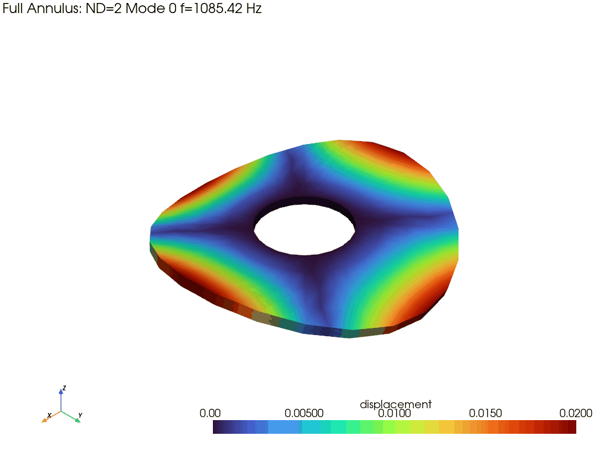
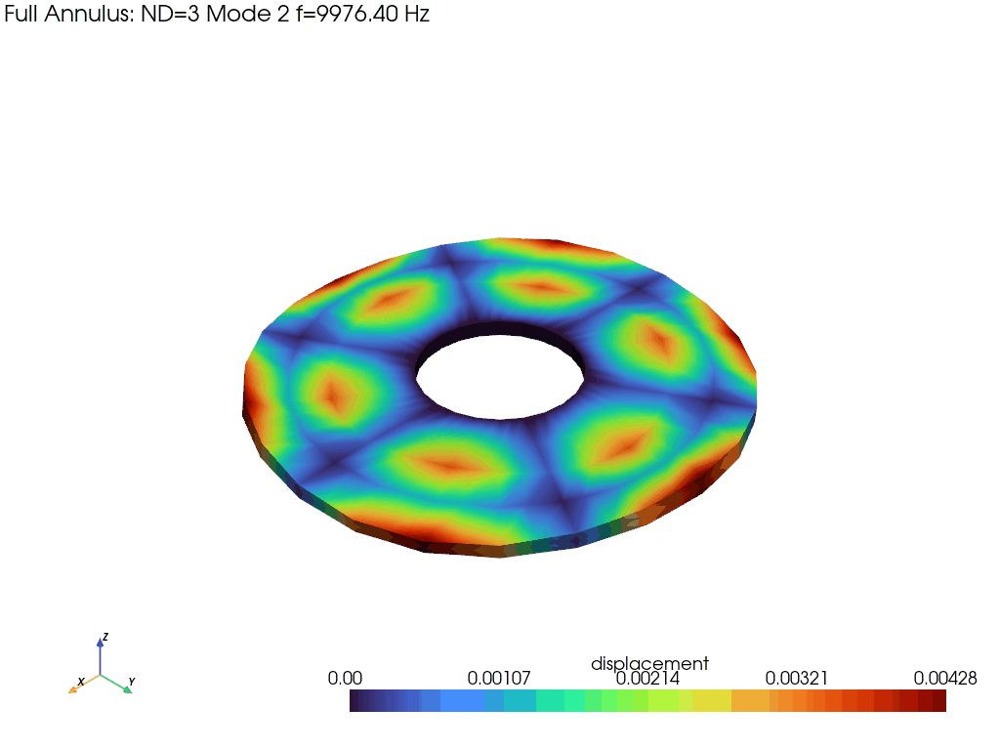
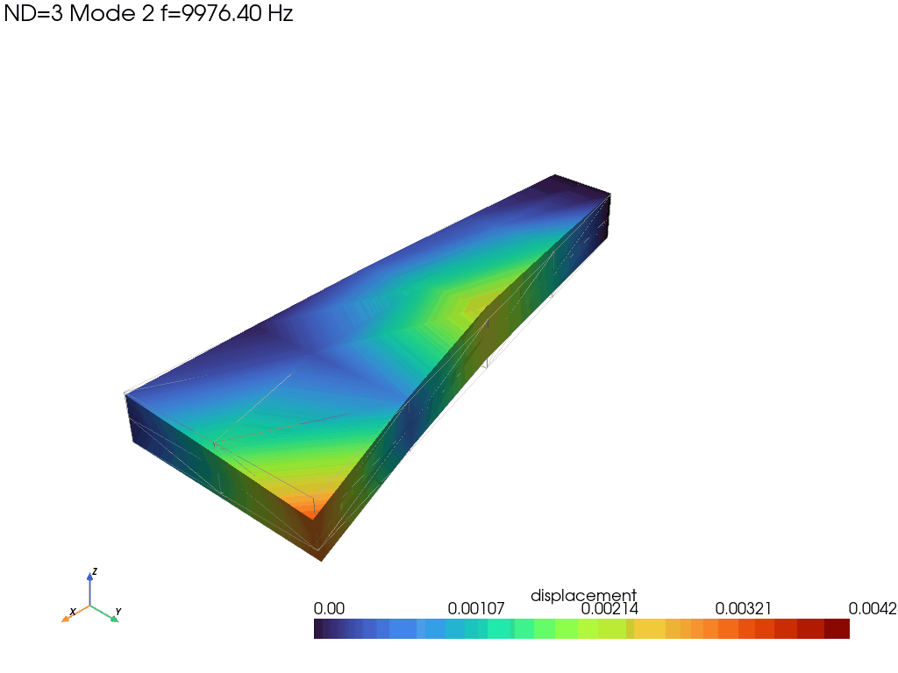

# turbomodal
>
> [!NOTE]
> This is a **work in progress**, and the repository is considered in a **beta state**. The roadmap to the `v1.0.0` official release can be found [here](ROADMAP.md).
---
Cyclic symmetry FEA solver with ML-based modal identification for turbomachinery bladed disks.

**Platforms:** Linux, macOS, Windows &nbsp;|&nbsp; **Python:** 3.9+ &nbsp;|&nbsp; **C++:** C++17

> Pre-built wheels are available on the [Releases](https://github.com/amoec/turbomodal/releases) page.
> See [Installation](#installation) below for building from source.

<p align="center">
  
  
</p>
<p align="center">
  <em>Animated mode shapes: 2 nodal diameters, 1st family (left) and 3 nodal diameters, 2nd family (right).</em>
</p>

## Overview

turbomodal is an end-to-end toolkit for turbomachinery modal analysis. It
combines a C++ finite element solver that exploits cyclic symmetry with a
Python machine learning pipeline that identifies vibration modes from sensor
measurements.

## Documentation

- [Installation Guide](docs/installation.md)
- [Quick Start Tutorial](docs/quickstart.md)
- [Architecture](docs/architecture.md)
- API Reference:
  [Core](docs/api/core.md) |
  [Signals](docs/api/signals.md) |
  [Data](docs/api/data.md) |
  [Analysis](docs/api/analysis.md) |
  [ML](docs/api/ml.md) |
  [Optimization](docs/api/optimization.md)
- [ML Guide](docs/ml-guide.md)
- [Validation Criteria](docs/validation.md)
- Examples:
  [Basic FEA](examples/python_example.py) |
  [Data Generation](examples/data_generation_pipeline.py) |
  [ML Training](examples/ml_pipeline.py) |
  [Visualizations](examples/generate_visualizations.py)

## Quick Start

### Minimal FEA Example

```python
import numpy as np
import turbomodal as tm

# Load a single-sector mesh and define material
mesh = tm.load_mesh("sector.msh", num_sectors=36)
mat  = tm.Material(E=200e9, nu=0.3, rho=7800)

# Solve cyclic symmetry modal analysis at 10 000 RPM
results = tm.solve(mesh, mat, rpm=10000, num_modes=5, verbose=1)

# Print frequencies for each nodal diameter
for r in results:
    freqs = ", ".join(f"{f:.1f}" for f in r.frequencies[:3])
    print(f"  ND={r.harmonic_index}: [{freqs}] Hz")

# RPM sweep and Campbell diagram
sweep = tm.rpm_sweep(mesh, mat, np.linspace(0, 15000, 20), num_modes=5)
tm.plot_campbell(sweep, engine_orders=[1, 2, 36])

# Animate a mode shape and save as GIF
tm.plot_mode(mesh, results[3], mode_index=2, scale=0.005,
             animate=True, full_annulus=False, filename="nd3_mode2_sector.gif")
```

<p align="center">
  
</p>
<p align="center"><em>Single-sector ND=3, mode 2 shape with wireframe reference geometry.</em></p>

### Signal Generation and ML Pipeline

```python
# Build a sensor array (8 BTT probes at one axial station)
sensors = tm._RemovedClass.default_btt_array(
    num_probes=8, casing_radius=0.25, axial_positions=[0.0]
)
sensor_array = tm._RemovedClass(mesh, sensors)

# Generate synthetic sensor signals with noise
sig_cfg   = tm._RemovedClass(sample_rate=100000, duration=0.5)
noise_cfg = tm._RemovedClass(gaussian_snr_db=30)
sig = tm._removed(
    sensor_array, results, rpm=10000, config=sig_cfg, noise_config=noise_cfg
)

# Extract features
features = _removed_func(sig["signals"], sig_cfg.sample_rate)
print(f"Feature vector length: {len(features)}")
```

### Parametric Sweep to HDF5

```python
from turbomodal import _RemovedClass, _RemovedClass, _removed
from turbomodal import _RemovedClass

sweep_cfg = _RemovedClass(
    ranges=[
        _RemovedClass("rpm", low=1000, high=15000),
        _RemovedClass("temperature", low=293, high=800),
    ],
    num_samples=200,
    num_modes=10,
)
ds_cfg = _RemovedClass(output_path="dataset.h5", include_mode_shapes=True)

_removed(mesh, mat, sweep_cfg, dataset_config=ds_cfg, verbose=1)
```

## Installation

### From source (recommended during development)

```bash
# Clone and enter the repository
git submodule update --init   # fetch Spectra header-only library

# Install in editable mode (builds C++ extension via scikit-build-core)
pip install -e ".[dev]"
```

### Build requirements

- Python 3.9+
- C++17 compiler (GCC 9+, Clang 10+, or MSVC 2019+)
- CMake 3.20+
- pybind11 >= 2.12
- Eigen 3.4.0 (fetched automatically by CMake)
- Spectra (header-only, included as git submodule in `external/spectra`)

### Python dependencies

Core (always required):

| Package    | Version  |
|------------|----------|
| numpy      | >= 1.22  |
| scipy      | >= 1.8   |
| pyvista    | >= 0.43  |
| matplotlib | >= 3.5   |
| gmsh       | >= 4.12  |
| meshio     | >= 5.3   |
| h5py       | >= 3.7   |

ML extras (`pip install -e ".[ml]"`):

| Package      | Version  |
|--------------|----------|
| scikit-learn | >= 1.2   |
| internal model      | >= 1.7   |
| torch        | >= 2.0   |
| shape        | >= 0.42  |
| internal       | >= 3.0   |
| internal tracker       | >= 2.10  |

See [docs/installation.md](docs/installation.md) for detailed platform-specific
instructions.

## Requirements

- **Python** >= 3.9
- **C++17** compiler (GCC 9+, Clang 10+, MSVC 2019+)
- **CMake** >= 3.20

Optional runtime dependencies (for ML features): scikit-learn, internal model,
PyTorch, Internal analysis, Internal, Internal tracker. These are installed automatically with
`pip install -e ".[ml]"`.

## Running Tests

```bash
# C++ unit tests (15 suites, ~25 seconds)
cd build && ctest --output-on-failure

# C++ validation tests (requires rebuild with slow tests enabled)
cmake .. -DBUILD_VALIDATION_TESTS=ON && cmake --build . && ctest --output-on-failure

# Python tests (13 test files, 210+ tests)
pytest python/tests/ -v

# Python validation tests only
pytest python/tests/ -v -m validation

# Python tests with coverage report
pytest python/tests/ -v --cov=turbomodal --cov-report=term-missing
```

The C++ test suite covers material properties, element stiffness/mass,
mesh I/O, global assembly, modal solver, cyclic symmetry, added mass,
rotating effects, damping, forced response, mistuning (FMM), mode
identification, and validation against Leissa plate theory, Kwak added
mass, and Coriolis splitting analytical solutions. The Python test suite
covers bindings, I/O, solver API, signal generation, noise models,
sensors, datasets, parametric sweeps, ML pipeline, sensor optimisation,
and end-to-end integration tests.

## Supported Mesh Formats

| Format            | Extension(s)         | Loader           |
|-------------------|----------------------|------------------|
| gmsh MSH          | `.msh`               | C++ native       |
| NASTRAN           | `.bdf`, `.nas`       | meshio           |
| Abaqus            | `.inp`               | meshio           |
| VTK               | `.vtk`, `.vtu`       | meshio           |
| CGNS              | `.cgns`              | meshio           |
| Salome MED        | `.med`               | meshio           |
| XDMF              | `.xdmf`              | meshio           |
| STEP / IGES / BREP| `.step`, `.iges`, ...| gmsh (CAD import)|

## License

MIT License Copyright (c) 2026 Adam Moëc
